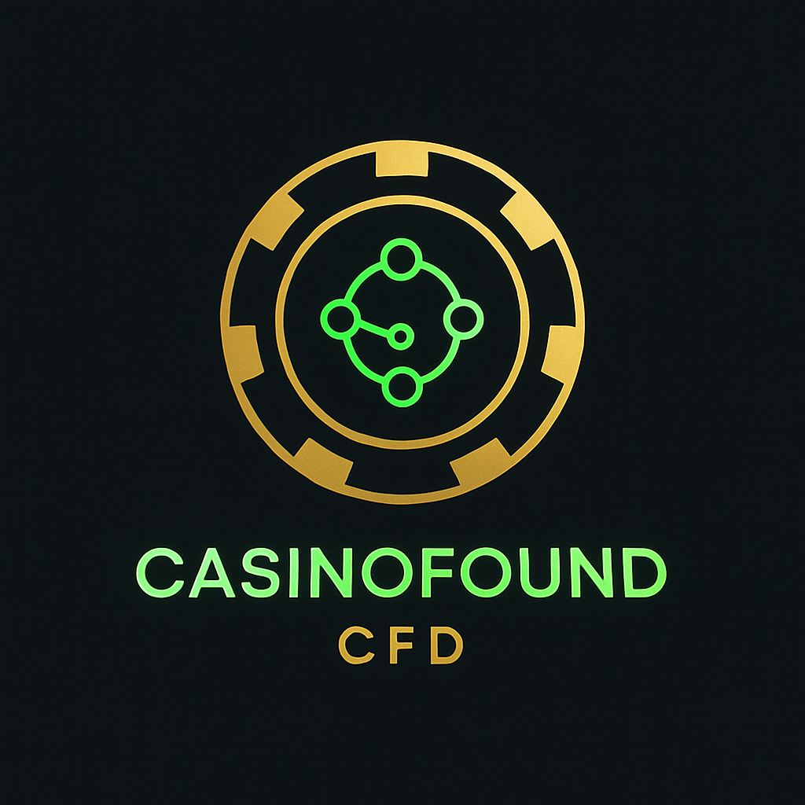

# CasinoFound - CFD Token



Um site completo para o projeto CasinoFound, uma criptomoeda baseada na rede Polygon (Matic) criada para financiar o lançamento e operação de um casino online inovador.

## 🎯 Visão Geral

O CasinoFound é um projeto de criptomoeda que permite aos detentores de tokens CFD participarem dos lucros do casino através de um sistema de staking. O site oferece uma experiência completa com área de cliente, painel administrativo e suporte multi-idioma.

## ✨ Funcionalidades

### 🏠 Site Principal
- **Página Inicial** com countdown para lançamento do casino
- **Informações da ICO** com fases e preços atuais
- **Whitepaper** completo do projeto
- **Roadmap** detalhado de desenvolvimento
- **Tokenomics** com distribuição de tokens
- **Página da Equipe** com informações dos membros

### 🔐 Área do Cliente (Cofre Digital)
- **Conexão com Carteira** via WalletConnect
- **Compra de Tokens** com USDT e MATIC
- **Sistema de Staking** para receber dividendos
- **Visualização de Saldos** e porcentagens
- **Histórico de Transações**

### ⚙️ Painel Administrativo
- **Autenticação** específica para wallet do administrador
- **Edição de Conteúdo** do site em tempo real
- **Configurações de Blockchain** (contratos, ABIs)
- **Gestão de Traduções** para todos os idiomas
- **Dashboard** com estatísticas

### 🌍 Sistema Multi-idioma
- **Português** (idioma padrão)
- **Inglês**
- **Francês**
- **Chinês**
- **Detecção automática** do idioma do navegador
- **Seletor manual** de idioma

## 🛠️ Tecnologias Utilizadas

### Frontend
- **React 19** - Framework principal
- **Vite** - Build tool e dev server
- **Tailwind CSS** - Estilização
- **Shadcn/UI** - Componentes de interface
- **Lucide React** - Ícones

### Blockchain
- **Wagmi** - Hooks para Ethereum
- **Viem** - Biblioteca Ethereum TypeScript
- **WalletConnect** - Conexão com carteiras
- **Ethers.js** - Interação com blockchain

### Internacionalização
- **React i18next** - Sistema de traduções
- **i18next** - Core de internacionalização

### Outras
- **React Router** - Roteamento
- **Date-fns** - Manipulação de datas
- **Sonner** - Notificações toast

## 🚀 Instalação e Desenvolvimento

### Pré-requisitos
- Node.js 18+ 
- npm ou pnpm

### Instalação
```bash
# Clone o repositório
git clone <url-do-repositorio>
cd casinofound-project

# Instale as dependências
npm install
# ou
pnpm install

# Configure as variáveis de ambiente
cp .env.example .env.local
```

### Configuração das Variáveis de Ambiente
Crie um arquivo `.env.local` na raiz do projeto:

```env
VITE_WALLETCONNECT_PROJECT_ID=seu_project_id_aqui
VITE_CONTRACT_ADDRESS=0x...
VITE_ADMIN_WALLET=0x...
VITE_USDT_CONTRACT=0x...
VITE_MATIC_CONTRACT=0x...
```

### Executar em Desenvolvimento
```bash
npm run dev
# ou
pnpm dev
```

O site estará disponível em `http://localhost:5173`

### Build para Produção
```bash
npm run build
# ou
pnpm build
```

Os arquivos de produção serão gerados na pasta `dist/`

## 📁 Estrutura do Projeto

```
casinofound-project/
├── public/
│   ├── locales/          # Arquivos de tradução
│   │   ├── pt/
│   │   ├── en/
│   │   ├── fr/
│   │   └── zh/
│   ├── team/             # Imagens da equipe
│   ├── favicon.png
│   └── favicon.svg
├── src/
│   ├── components/       # Componentes React
│   │   ├── ui/          # Componentes de interface
│   │   └── admin/       # Componentes do painel admin
│   ├── contexts/        # Contextos React
│   ├── lib/             # Utilitários e configurações
│   ├── pages/           # Páginas da aplicação
│   │   └── admin/       # Páginas do painel admin
│   ├── utils/           # Funções utilitárias
│   ├── App.jsx          # Componente principal
│   ├── main.jsx         # Ponto de entrada
│   └── index.css        # Estilos globais
├── TUTORIAL-HOSPEDAGEM.md
├── README.md
├── package.json
├── tailwind.config.js
├── postcss.config.js
└── vite.config.js
```

## 🎨 Design e Tema

O site utiliza um **tema escuro elegante** com:
- **Cores principais**: Preto/cinza escuro (#0f0f0f)
- **Destaques**: Dourado (#FFD700) e verde neon (#00FFC8)
- **Tipografia**: Moderna e limpa
- **Efeitos**: Gradientes sutis e brilhos neon
- **Responsividade**: Compatível com desktop e mobile

## 🔗 Integração Blockchain

### Redes Suportadas
- **Polygon (Matic)** - Rede principal
- **Polygon Mumbai** - Rede de teste

### Contratos Inteligentes
O projeto interage com contratos para:
- **Token CFD** - Token principal do projeto
- **Staking** - Sistema de staking para dividendos
- **ICO** - Venda de tokens em fases
- **USDT/MATIC** - Tokens de pagamento

### Funcionalidades Blockchain
- Conexão com carteiras (MetaMask, WalletConnect, etc.)
- Compra de tokens com USDT ou MATIC
- Staking e unstaking de tokens
- Visualização de saldos e recompensas
- Histórico de transações

## 👥 Painel Administrativo

### Acesso
O painel administrativo está disponível em `/admin` e requer:
- Conexão com a wallet do administrador
- Wallet configurada na variável `VITE_ADMIN_WALLET`

### Funcionalidades
- **Dashboard**: Estatísticas e métricas
- **Conteúdo**: Edição de textos e imagens
- **Configurações**: Parâmetros da ICO e blockchain
- **Idiomas**: Gestão de traduções

## 🌐 Hospedagem

O projeto pode ser hospedado gratuitamente em:

### Plataformas Recomendadas
1. **Vercel** (Recomendado)
2. **Netlify**
3. **GitHub Pages**

### Tutorial Completo
Consulte o arquivo `TUTORIAL-HOSPEDAGEM.md` para instruções detalhadas de como hospedar o site em cada plataforma.

## 🔧 Configuração de Produção

### Variáveis de Ambiente Necessárias
```env
VITE_WALLETCONNECT_PROJECT_ID=
VITE_CONTRACT_ADDRESS=
VITE_ADMIN_WALLET=
VITE_USDT_CONTRACT=
VITE_MATIC_CONTRACT=
```

### Arquivos de Configuração
- `vercel.json` - Para deploy na Vercel
- `_redirects` - Para deploy na Netlify
- `.env.local` - Variáveis de ambiente locais

## 📱 Responsividade

O site é totalmente responsivo e otimizado para:
- **Desktop** (1920px+)
- **Laptop** (1024px - 1919px)
- **Tablet** (768px - 1023px)
- **Mobile** (320px - 767px)

## 🔒 Segurança

### Medidas Implementadas
- Autenticação via blockchain
- Validação de contratos inteligentes
- Sanitização de inputs
- HTTPS obrigatório
- Proteção contra XSS

### Wallet do Administrador
- Acesso restrito ao painel administrativo
- Verificação de assinatura digital
- Logs de ações administrativas

## 🚀 Performance

### Otimizações
- **Code Splitting** - Carregamento sob demanda
- **Lazy Loading** - Componentes carregados quando necessário
- **Tree Shaking** - Remoção de código não utilizado
- **Minificação** - Compressão de arquivos
- **CDN** - Distribuição global de conteúdo

### Métricas
- **First Contentful Paint**: < 1.5s
- **Largest Contentful Paint**: < 2.5s
- **Cumulative Layout Shift**: < 0.1
- **Time to Interactive**: < 3.5s

## 🧪 Testes

### Testes Realizados
- ✅ Funcionalidades de blockchain
- ✅ Responsividade em diferentes dispositivos
- ✅ Compatibilidade entre navegadores
- ✅ Performance e velocidade
- ✅ Acessibilidade básica
- ✅ Sistema multi-idioma

### Navegadores Suportados
- Chrome 90+
- Firefox 88+
- Safari 14+
- Edge 90+

## 📞 Suporte

### Documentação
- `README.md` - Este arquivo
- `TUTORIAL-HOSPEDAGEM.md` - Tutorial de hospedagem
- Comentários no código fonte

### Contato
Para suporte técnico ou dúvidas sobre o projeto, entre em contato através dos canais oficiais do CasinoFound.

## 📄 Licença

Este projeto é propriedade do CasinoFound. Todos os direitos reservados.

---

**Desenvolvido com ❤️ para o futuro dos jogos online descentralizados.**

